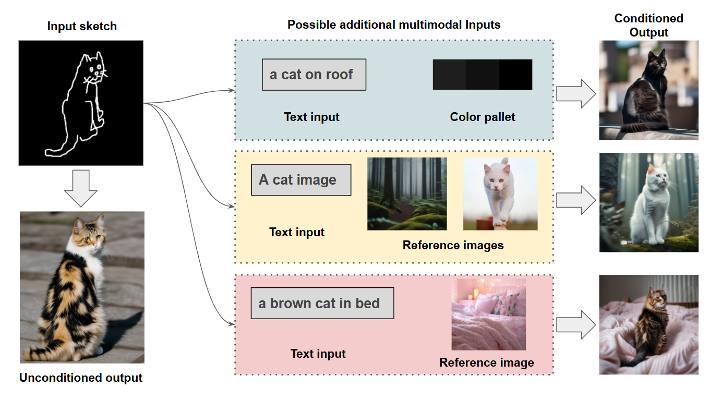

# Fuse-and-Diffuse: A Hybrid GAN-Diffusion Framework for Disentangled and Controllable Sketch-to-Image Synthesis

**Authors:** Ankush Jain, Ravi Kumar, Siddhant  
**Affiliation:** Department of Computer Science and Engineering, Netaji Subhas University of Technology (NSUT), New Delhi

---



## Overview

**Fuse-and-Diffuse** is a state-of-the-art framework for controlling image generation using multiple modalities: **Sketch, Style (Reference Image), Color, and Text**. 

By combining a **Dual-Branch GAN Refiner** (Stage 1) with a frozen **Stable Diffusion XL (SDXL)** backbone equipped with a novel **Adapters Cluster** (Stage 2), we achieve unprecedented control and fidelity.

## Key Features

*   **Hybrid Architecture**: GAN for structure, Diffusion for texture.
*   **SDXL Backbone**: Leverages the power of Stable Diffusion XL.
*   **Adaptive Gating Unit (AGU)**: Dynamic arbitration between adapters to prevent concept bleeding.
*   **Multi-Modal**: Supports Sketch + Style + Color + Text.

## Directory Structure

```
Fuse-and-Diffuse/
├── assets/                 # Project assets and paper figures
├── configs/                # Configuration files
│   ├── datasets/           # Dataset configs (QMUL, SketchyCOCO, Pseudosketches)
│   └── models/             # Model architectures and hyperparams
├── data/                   # Data loaders and factory
├── docs/                   # Documentation
├── models/                 # Model implementations
│   ├── gan/                # Stage 1: Dual-Branch GAN
│   └── diffusion/          # Stage 2: SDXL + Adapters + AGU
├── scripts/                # Training and utility scripts
└── utils/                  # Logging, metrics, and visualization tools
```

## Installation

1.  Clone the repository:
    ```bash
    git clone https://github.com/RaviKumar300/Fuse-and-Diffuse.git
    cd Fuse-and-Diffuse
    ```

2.  Install dependencies:
    ```bash
    pip install -r requirements.txt
    ```

## Data Preparation

We support three primary datasets:
1.  **QMUL-Sketch+**: For fine-grained object retrieval and synthesis.
2.  **SketchyCOCO**: For complex scene-level sketches.
3.  **Pseudosketches**: Large-scale paired synthetic sketches.

To download and prepare the datasets, run:
```bash
chmod +x scripts/download_datasets.sh
./scripts/download_datasets.sh all
```

## Training

### Stage 1: GAN Refiner
Train the Dual-Branch GAN to refine noisy sketches into clean line art.
```bash
python scripts/train_stage1_gan.py --dataset QMUL-Sketch+
```

### Stage 2: Diffusion Adapters
Train the Adapters Cluster on top of the frozen SDXL backbone.
```bash
python scripts/train_stage2_diffusion.py --dataset SketchyCOCO
```

## Citation

If you use this code or dataset, please cite our paper:
```bibtex
@inproceedings{jain2024fuse,
  title={Fuse-and-Diffuse: A Hybrid GAN-Diffusion Framework},
  author={Jain, Ankush and Kumar, Ravi and Siddhant},
  year={2024}
}
```
