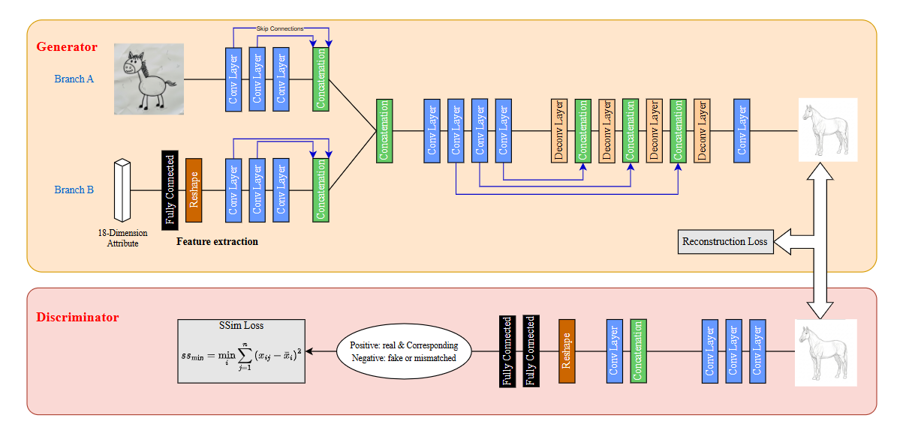
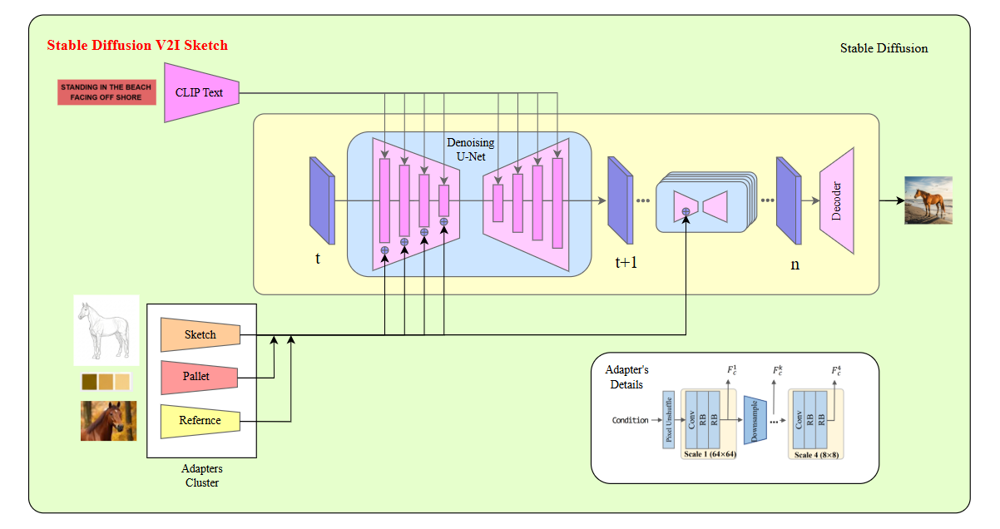
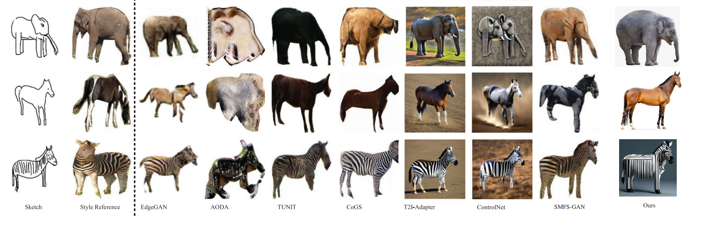

# Fuse-and-Diffuse: A Hybrid GAN-Diffusion Framework for Disentangled and Controllable Sketch-to-Image Synthesis

**Authors:** Ankush Jain, Ravi Kumar, Siddhant  
**Affiliation:** Department of Computer Science and Engineering, Netaji Subhas University of Technology (NSUT), New Delhi

---

## Abstract

Stable Diffusion models have demonstrated remarkable capability in generating photorealistic images; however, achieving fine-grained, user-controllable synthesis remains challenging. In sketch-based image generation, this difficulty is compounded by the nature of human-made sketches—unlike edge maps, these sketches often contain abstract, exaggerated, or incomplete lines. Moreover, maintaining object-level consistency across multiple generated images poses a persistent problem.

To address these issues, we propose **Fuse-and-Diffuse**, a hybrid generative framework that integrates multiple conditioning modalities—text, sketch, reference image, and color information—to provide granular and interpretable control. The model first refines the input sketch into a structurally coherent line-art representation and then employs a Latent Diffusion Model conditioned on the fused multimodal signals. Through a modular adapter design and a novel Adaptive Gating Unit, our approach effectively disentangles and integrates these modalities without retraining the base diffusion backbone.

## Key Features

* **Hybrid Architecture:** Combines a Dual-Branch GAN for structural refinement with a Latent Diffusion Model (LDM) for photorealistic synthesis, solving the "imbalanced division of responsibilities" inherent in end-to-end models.
* **Adapters Cluster:** A novel design employing four lightweight, parallel adapters to inject conditioning signals (structure, semantics, style, and color) into a frozen LDM.
* **Adaptive Gating Unit (AGU):** A dynamic arbitration module that predicts scalar weights for each adapter based on text context and diffusion timesteps, effectively preventing "concept bleeding" and conflicting modalities.
* **Disentangled Control:** Successfully decouples structure (from sketches) and style (from reference images), allowing for precise "zebra in this pose" but "painted in this style" synthesis.
* **Robust to Noisy Inputs:** Unlike ControlNet which may interpret messy strokes literally, our Stage-1 Refiner cleans abstract sketches into canonical line art before synthesis.

## Methodology

The framework operates in two distinct stages to separate the role of "designer" (structural interpretation) from "painter" (rendering).

### Stage 1: The Fuse Stage (Structural Refinement)

The first stage addresses the ambiguity of free-hand sketches. We employ a **Dual-Branch GAN** ($G_{refine}$) to map raw, noisy user sketches ($S_{raw}$) to clean, structurally coherent line art ($S_{refined}$).
* **Global Structure Branch:** Captures high-level composition using self-attention blocks.
* **Local Detail Branch:** Preserves fine details while suppressing noise using Gated Feature Injection mechanisms.
* **Objective:** Trained with Adversarial Loss (LSGAN), Multi-Scale SSIM loss, and LPIPS perceptual loss to ensure the output is a robust structural prior for the next stage.

### Stage 2: The Diffuse Stage (Latent Synthesis)

The second stage utilizes a **frozen Stable Diffusion v1.5 backbone**. Instead of retraining the U-Net, we introduce the **Adapters Cluster**:
1.  **Structural Adapter:** A ControlNet-style copy of the encoder that injects the refined sketch features via zero-convolutions.
2.  **Style Adapter:** Extracts style embeddings from reference images using CLIP and injects them via decoupled cross-attention (similar to IP-Adapter).
3.  **Color Adapter:** A novel module using a Differentiable Histogram (DHM) to project global color palettes into the cross-attention layers.
4.  **Text Adapter:** Utilizes the standard CLIP text encoder.

### Adaptive Gating Unit (AGU)
To fuse these signals without interference, the AGU learns to dynamically weight the adapters. It takes the text prompt and current timestep $t$ as input.
* **Time-Aware:** It can prioritize structural guidance at early timesteps (layout generation) and style/color at later timesteps (texture refinement).
* **Context-Aware:** If the text prompt specifies "monochrome," the AGU suppresses the Color Adapter automatically.

## Results

Quantitative experiments on QMUL-Sketch+, SketchyCOCO, and Pseudosketches demonstrate state-of-the-art performance.

* **Structural Fidelity:** Outperforms ControlNet and T2I-Adapter in SSIM scores, proving superior adherence to input sketches.
* **Style Consistency:** Achieves lower Style Distance metrics, effectively capturing reference textures without overriding the sketch structure.
* **Modality Fusion:** As seen in the example above, Fuse-and-Diffuse is the only method capable of applying an artistic style to a sketch-defined pose without generating generic photorealistic objects.

## Usage and Implementation

*Code release and folder structure explanation to be added.*
